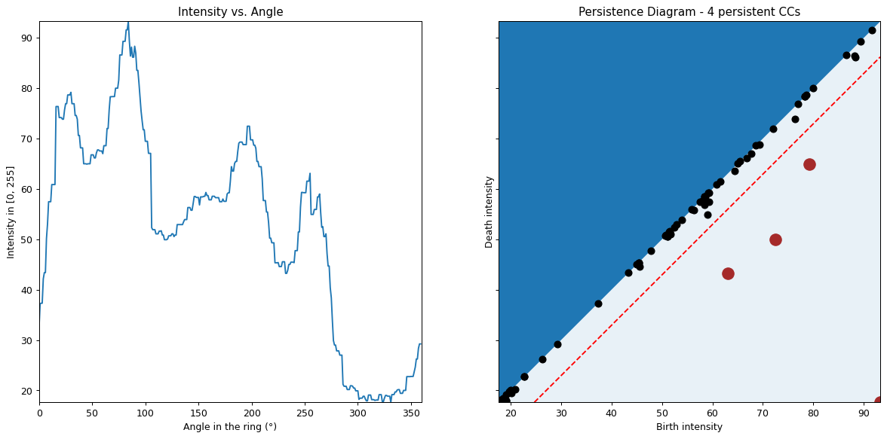

#  Persistence diagrams for corner detection in images of retinal cells

<p align="left">
  <a href="#getting-started">Getting started</a> •
  <a href="#principle">Principle</a> •
  <a href="#persistence-diagram">Persistence Diagram</a>
</p>

<p align="center">
  
</p>

## Getting started

Dependencies are in `requirements.txt`. 

**Basic use**

```bash
python main.py
```

This will display a default image of cells. Select a point to run the analysis on. The output images are stored in `out/`. 

**GIF of animated persistence diagram**

```bash
python main.py --gif
``` 

The GIF is stored at `out/persistence_diagram.gif`.

**Options**

It is possible to change the default image, the default values of the hyper parameters (shape of the ring, minimum persistence to separate noisy peaks vs. major peaks etc.). Enter `python main.py -h` for details.

## Principle

<p align="center">
  
</p>

**Goal**: classify the selected pixel (red) as belonging to a *corner*, an *edge* or simply *background*. 

We use persistence diagrams to count the number of peaks of significant intensity in the blue ring around the selected pixel.

We then apply the following classification rule: 
- if the intensity in the ring has two main peaks, then our point belongs to an edge
- if the intensity in the ring has three or more major peaks, our point belongs to a corner
- else, our point belongs to background.
  

## Persistence Diagram

<p align="center">
  
</p>

**Left**: The intensity of the pixels in the ring as a function of their angle in the ring. **Right**: The corresponding persistence diagram. 

Let $f:[0, 360] \rightarrow [0, 255]$ be the function mapping angle to intensity (left plot). For a given intensity *y* in *[0, 255]*, we consider the **connected components** (CCs) of the preimage set { $x \in [0, 360]: f(x) \in [y, +\infty)$ }.

We then vary the intensity $y$ from 255 down to 0. At each step, we compute the CCs of the preimage and keep track of the intensity at which each CC appears ( $y_{birth}$ ) and disappears ( $y_{death}$ ). The persistence diagram is the graphical representation of these events: each CC is a plotted as a point with coordinates $[y_{birth}, y_{death}]$.

> In the example above, the persistence diagram shows that 4 CCs have a significant lifetime. We then apply the classification rule and deduce that the point of interest is located on a corner (4 major intensity peaks).

---

**Intuitive view of persistence diagrams** 

In the ring, consider the mapping *angle -> intensity* as a mountain relief, where the angle is the horizontal position and the intensity is the altitude. Fill this landscape with water until the highest mountain is covered up. Then, slowly empty the water and keep track of two events:

- The *birth* of a mountain: the water level when it first emerges.
- The *death* of a mountain: the water level when it merges with another moutain (when the level becomes too low to separate the two islands). 

Then, represent each mountain in the persistence diagram as a point [birth, death]. During the water descent, *noisy* peaks will emerge and quickly be merged with a higher peak: they have a small persistence. On the contrary, *major* peaks are characterized by a longer persistence. Therefore, in the persistence diagram, we found the noisy peaks close to the diagonal, and the major peaks further away from the diagonal. 


