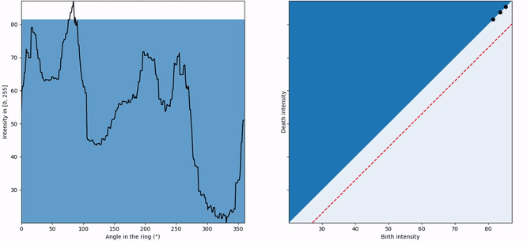

<h1 align="center">
  Topological Data Analysis for Corner Detection in images of Retinal Cells
</h1>

In images of retinal cells, we use persistence diagrams to classify a given pixel as a corner, an edge, etc.

<p align="center">
  
</p>

## Principle

<p align="center">
  
</p>

**Goal**: classify the selected pixel (red) as belonging to a *corner*, an *edge* or simply *background*. 

To do so, we consider the pixels of a ring (blue) centered on our point of interest. 

<p align="center">
  
</p>

*Left*: the intensity of the pixels in the ring as a function of their angular position in the ring. 
*Right*: the corresponding persistence diagram.


## Getting started

### Installation

- Clone the project
```bash
git clone https://github.com/bloodymosquito/tda-retinal-cells
```

- Create a virtual environment (optional)
```bash
virtualenv -p python3 <location_of_the_new_virtualenv>
source <location_of_the_new_virtualenv>/bin/activate
```

- Install the necessary packages (numpy, matplotlib, opencv)
```bash
cd tda-retinal-cells
pip install -r requirements.txt
```

### Basic use

```bash
python main.py
```

This will display a default image of cells. Select a point to run the analysis on. 

### Options

